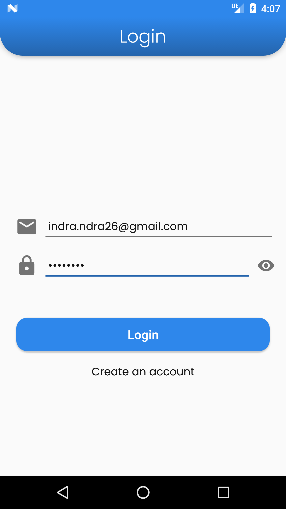
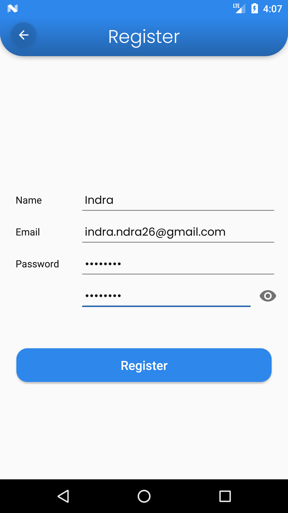

## Login - Register

Android Login - Register Using MVVM Design Pattern

## Features
- Kotlin
- MVVM Design Pattern
- View Binding
- Kotlin Coroutines
- Android Navigation Component
- Android Preferences
- Retrofit2 for API Client
- Authentication From Backend API

## Notes
- Build on android studio 4.0

## Screenshots

    
    

